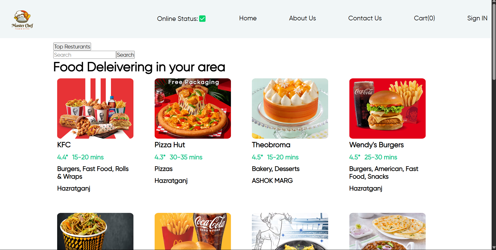
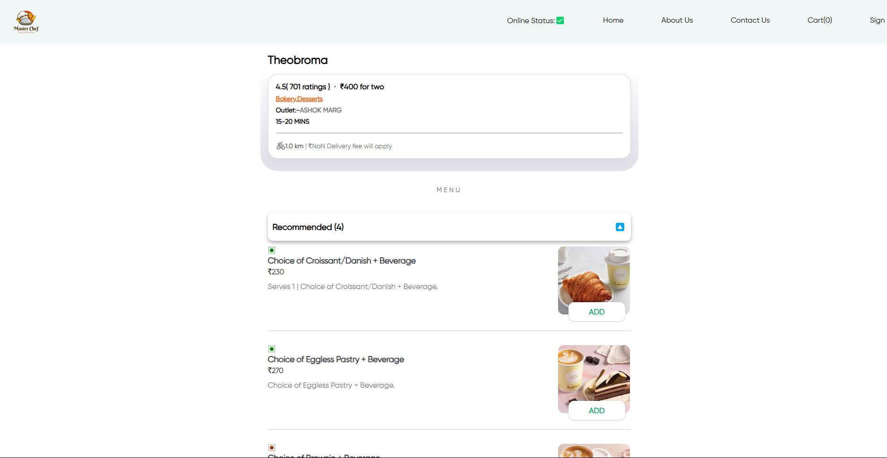

# 🍔 Food App – Swiggy Frontend Clone

This is a **frontend-only food delivery application** built entirely from scratch using **React and Parcel**, without using any boilerplate frameworks like `create-react-app`. It simulates a Swiggy-like user experience with live data from the **unofficial Swiggy API**.

> 💡 This project showcases **core React knowledge** with custom configuration, manual routing, and component structuring — no scaffolding tools or CSS libraries like Tailwind were used.

---

## 🚀 Features

- 🔍 Search restaurants by name or keyword
- 📡 Live data fetching from the Swiggy API
- 🛒 Dummy cart functionality (add items, view count)
- 📋 Accordion-style UI for menu categories
- 🔄 Conditional rendering and component-based architecture

---

## 🧑‍💻 Tech Stack

- **React (built manually without CRA)**
- **JavaScript (ES6+)**
- **Parcel** – Module bundler
- **HTML/CSS**
- **Swiggy Public API (Unofficial)**

---


## 📸 Screenshots

###  Home Page


### Restaurant Page



> 📁 All screenshots are located in the `assets/` folder.


## 🧪 Getting Started

To run this project locally:

```bash
git clone https://github.com/yourusername/food-app
cd food-app
npm install
npm start
```

#📂 Folder Structure
food-app/
├── assets/
│   ├── home.png
│   ├── restaurant.png
│
├── src/
│   ├── Components/
│   │   ├── About.js
│   │   ├── Body.js
│   │   ├── Cart.js
│   │   ├── Header.js
│   │   ├── RestaurantCard.js
│   │   ├── RestaurantMenu.js
│   │   └── ...other components
│   ├── App.js
│   ├── index.js
│   └── style.css
├── package.json
├── README.md
└── .gitignore

## 🐞 Known Issues

- ❗ **CORS Restrictions**: Since the Swiggy API is unofficial and not designed for public access, direct API requests from the browser often get blocked by CORS. Use a browser extension (like CORS Unblocker) during development or set up a proxy server to bypass it.
- 📦 **No Backend**: This project is frontend-only and doesn't persist cart data or checkout state.
- ⚡ **API Limitations**: Sometimes, the API may return incomplete or outdated data if Swiggy changes their structure.

> These limitations are expected due to the experimental nature of using unofficial APIs.

## Acknowledgment
- Data source: Unofficial Swiggy API